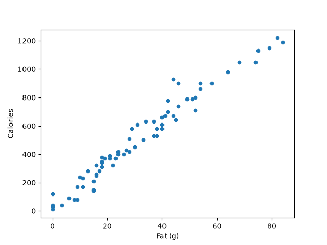

# Burger King: Fat (g) vs Calories

## Problem
Predict the number of calories in a Burger King menu item from the amount of fat it contains.

## Dataset (`burger-king-menu.csv`)
The file has 77 menu items and 14 columns, with no missing values. `Item` is the product name and `Category` is Breakfast (33), Burgers (26) or Chicken (18). The other 12 columns are nutrition values: Calories, Fat Calories, Fat (g), Saturated Fat (g), Trans Fat (g), Cholesterol (mg), Sodium (mg), Total Carb (g), Dietary Fiber (g), Sugars (g), Protein (g) and Weight Watchers points. Hamburger, Cheeseburger and the 4pc and 6pc Chicken Nuggets each appear twice, so the duplicates are removed, which leaves 73 items.

## Choosing the two features
The correlation of each numeric column with Calories:

| Feature | Correlation with Calories |
|---|---|
| Weight Watchers | 1.00 |
| Fat (g) | 0.98 |
| Fat Calories | 0.98 |
| Protein (g) | 0.91 |
| Saturated Fat (g) | 0.88 |

Weight Watchers points and Fat Calories are calculated from calories and fat, so they were not used. Fat (g) has the highest correlation of the remaining nutrients, which gives:

- **X = Fat (g)**
- **y = Calories**

## Solution
The model is a Linear Regression (`sklearn.linear_model.LinearRegression`), which learns the line `Calories = θ0 + θ1 × Fat`. It is trained on all 73 items.

## Results
| Result | Value |
|---|---|
| Intercept (θ0) | 45.99 |
| Slope (θ1) | 14.69 calories per gram of fat |
| R² | 0.959 |
| Prediction for a new item with 30 g fat | ≈ 487 calories |

Fat explains about 96% of the variation in calories. Each extra gram of fat adds about 14.7 calories on average.

## Files
- `burger_calories.ipynb`: the code
- `burger-king-menu.csv`: the dataset
- `fat_vs_calories.png`: the plot of the two features
- `README.md`: this documentation
